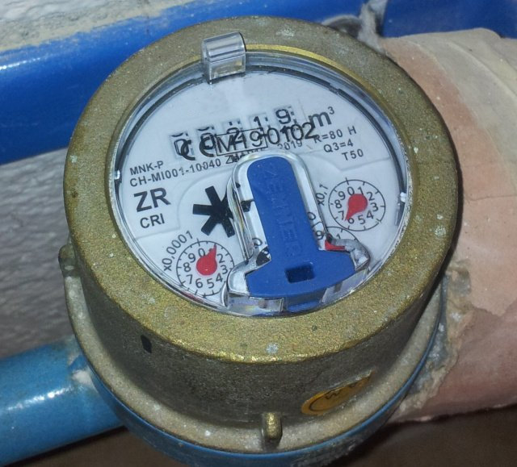
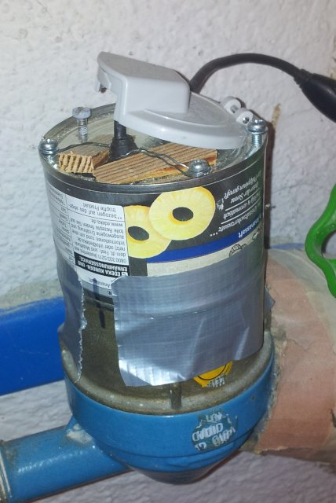
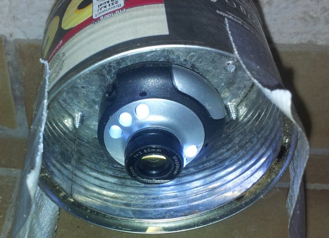
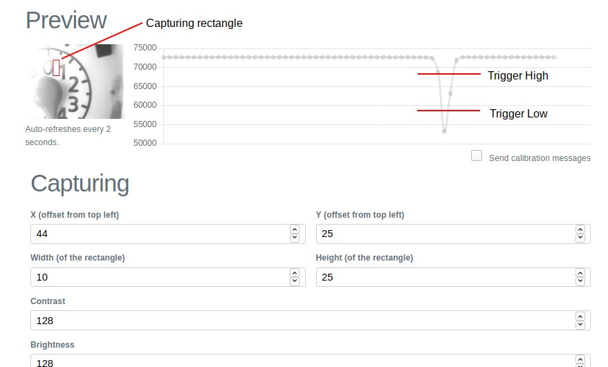

# Wossa

Measure your water usage even if you don't have a smart meter.

It works by counting impulses from a regular water meter with the help of a webcam and this app.

## Hardware setup

You need a water meter with a rotating needle, as seen in the following image.
We are interested in the red needle with the _x0.0001_ scale (1 liter per rotation).
One of the other scales could also be used if you don't need the most exact measurements.



Put your camera in a case above the water meter so it can clearly see the rotating needle. Make sure there is consistent lighting in the case.




## Software setup

Copy `wossa-<version>.tar.gz` to your Raspberry Pi. Use `tar xzf wossa-<version>.tar.gz` to unpack it and run `./wossa`.

This will try to use the camera at `/dev/video0`. The web interface is available at _http://[IP of your Raspberry Pi]:8080_.

See `./wossa -h` on how to use a different video device or HTTP port.

To install _wossa_ as a systemd service, run `sudo install.sh`.

## Usage

Open the settings page and define a capturing rectangle. It should be in a spot that provides the most contrast when the needle moves over it.

Use the calibration messages to define the high/low thresholds that are used to detect one impulse. To save CPU resources, disable the calibration messages after you are done.

You may be able to improve detection by adjusting the _brightness_ and _contrast_ settings.



To set the initial meter value, enable _Override current meter value_ and enter the current value.

_wossa_ logs every impulse via MQTT. Broker and topic can be configured in the _Connectivity_ section.

Note: It is currently not possible to use _wossa_ without MQTT.

## API

The following REST endpoints are available:

* `/api/v1/meter.json` - GET the latest meter value, POST to set the meter value.
* `/api/v1/config.json` - GET the current config, POST to update the config. Posting a partial config to update only some values is supported.
* `/api/v1/preview.jpg` - GET the latest preview image

## Development

```
# Build and run
make
./wossa

# Build release for Raspberry Pi, Beagle Bone
make release GOOS=linux GOARCH=arm GOARM=7

# Build and install on Raspberry Pi, Beagle Bone
make install GOOS=linux GOARCH=arm GOARM=7 TARGET_HOST=debian@beaglebone
```

## Roadmap

* Post to HTTP endpoint in addition to MQTT.
* Provide websocket in addition to MQTT.
* Send alarm message if meter doesn't stand still for X hours (useful for leak detection).
* Use generic units instead of liters. _wossa_ can be used for counting any kind of impulse.
